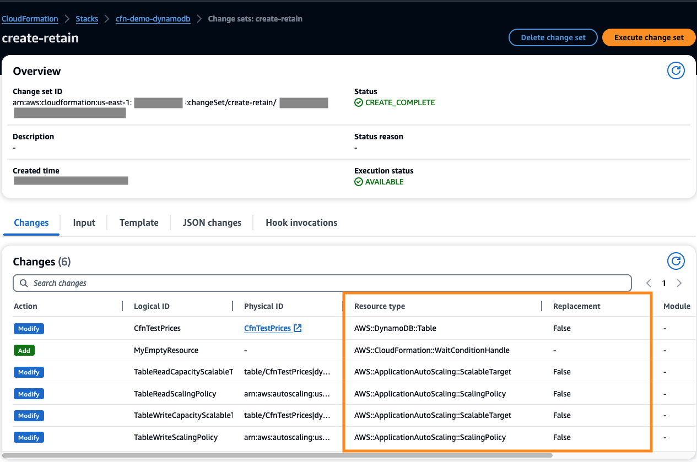
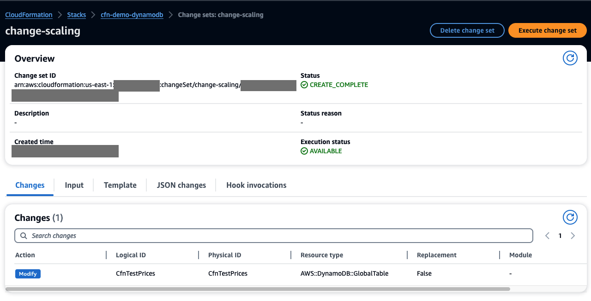

# How to change a DynamoDB Table to Global Table with AWS CloudFormation

It is common to have policies in place to only allow changes via infrastructure as code (IaC)
to ensure changes made in production environments are controlled.
To provide additional resiliency to your applications, 
you can use Amazon DynamoDB global tables that is a fully managed, serverless, multi-active, and multi-Region database.

### Using AWS console
To change a DynamoDB table to a global table via AWS console, you follow these steps:
- Open AWS console and find your DynamoDB table: [https://console.aws.amazon.com/dynamodb](https://console.aws.amazon.com/dynamodb)
- Go to **Global tables** tab, and add a replica in another AWS Region

If your table has provisioned capacity mode, auto-scaling for write must be enabled on your table and its GSIs (if there are any).
If DynamoDB streams is not enabled for your table, it will automatically be enabled when you create a replica for your table via AWS console.

### Using AWS CloudFormation

If your infrastructure is managed via AWS CloudFormation,
to change a DynamoDB table (`AWS::DynamoDB::Table`) to a global table (`AWS::DynamoDB::GlobalTable`) using only CloudFormation,
you **must** follow the instruction explained below.
This way, you protect your table from accidental deletion, as well as, 
possible negative impact on the performance of your table because of changing your table to a global table.

**WARNING! Use these steps with caution. If you do not follow these steps properly, you may delete your DynamoDB Table.**

## About this repository

This repository walks you through the required steps to change the resource type of DynamoDB table (with provisioned capacity mode and auto-scaling enabled) in CloudFormation template
from `AWS::DynamoDB::Table` to `AWS::DynamoDB::GlobalTable`.
The **global table (`AWS::DynamoDB::GlobalTable`) has version 2019.11.21**.

This example uses the AWS provided auto-scaling role: `aws-service-role/dynamodb.application-autoscaling.amazonaws.com/AWSServiceRoleForApplicationAutoScaling_DynamoDBTable`.
If you have your own role, you can retain and use that role as well.

When running the steps explained below, check that you have sufficient permissions to run the commands in your own AWS account.

You can find more information about each step (in the form of comments) in the CloudFormation templates in this repository.
It is important to read the comments carefully to understand the changes happening in each step,
so that you make similar changes when running these steps on your own table(s).

## Before you begin

**To make this change safely on your DynamoDB table, it is immensely important to complete each step successfully before performing the next step.**
**Use the instructions below and the scripts in this repository as a guideline to build your own process.
Before making any changes on your table in your production environment, 
test the following instruction and scripts on a test table with the same configuration as your production table in your test environment.**

See, [additional information related to changing a DynamoDB table to global table](https://docs.aws.amazon.com/AWSCloudFormation/latest/UserGuide/aws-resource-dynamodb-globaltable.html).

## Step-by-step instruction

### STEP 1: Create an initial DynamoDB table

Review the AWS resources in [cloudformation-1-initial.yaml](./cloudformation-1-initial.yaml) file.

In a terminal using an AWS profile with sufficient permissions in your AWS account, 
run the following command to deploy the example stack called `cfn-demo-dynamodb`.

```
aws cloudformation deploy \
  --template-file cloudformation-1-initial.yaml \
  --stack-name cfn-demo-dynamodb \
  --region us-east-1 \
  --capabilities CAPABILITY_NAMED_IAM \
  --parameter-overrides DBTableName=CfnTestPrices
```

This step creates a DynamoDB table named `CfnTestPrices` with a partition key, `price`, and sort key, `date`.
Notice that `StreamSpecification` is set to `StreamViewType: KEYS_ONLY` for table.
If DynamoDB streams is not enabled for the table, you get an error message when creating a replica in subsequent steps.

After the stack is deployed, open the AWS console for CloudFormation: [https://console.aws.amazon.com/cloudformation](https://console.aws.amazon.com/cloudformation), and find the stack called `cfn-demo-dynamodb`.

Check that you are in the same AWS Region, **us-east-1**, as the stack was deployed.
Clicking on the name of the stack `cfn-demo-dynamodb`, shows details of deployed AWS resources in this stack.
Later, in the following steps, you are asked to review the details of this stack as well as view the change sets.

### STEP 2: Required preparation

Review all the following changes **required** for this step in [cloudformation-2-deletionPolicy.yaml](cloudformation-2-deletionPolicy.yaml):
1. Set `DeletionPolicy: Retain` for `AWS::DynamoDB::Table`,
   `AWS::ApplicationAutoScaling::ScalableTarget`, and `AWS::ApplicationAutoScaling::ScalingPolicy` resources.
This is very important to protect the resources from deletion. In a later step, you will remove these resources from the template 
so they are no longer managed by CloudFormation. 
This setting ensures that these resources will not be deleted when performing that step.

2. Add `DeletionProtectionEnabled: true` to the DynamoDB table resource in the CloudFormation template.
   [This property was released in March of 2023](https://aws.amazon.com/about-aws/whats-new/2023/03/amazon-dynamodb-table-deletion-protection/)
   and ensures that the table can not be deleted without the proper IAM permissions.
   `DeletionProtectionEnabled` attribute will be moved to the replica specification in step 4
   as the resource type changes from `AWS::DynamoDB::Table` to `AWS::DynamoDB::GlobalTable`.

The following example shows the changes so far to protect the table and auto-scaling resources from deletion:

```
TableReadCapacityScalableTarget:
  Type: AWS::ApplicationAutoScaling::ScalableTarget
  DeletionPolicy: Retain
  ...

TableWriteScalingPolicy:
  Type: AWS::ApplicationAutoScaling::ScalingPolicy
  DeletionPolicy: Retain
  ...

CfnTestPrices:
  Type: AWS::DynamoDB::Table
  DeletionPolicy: Retain
  Properties:
    TableName: !Ref DBTableName
    DeletionProtectionEnabled: true
    ... 
```

3. **It is very important to add `DisableScaleIn: False` explicitly for `AWS::ApplicationAutoScaling::ScalingPolicy` resources in the CloudFormation template** 
to ensure that the scaling policies are **retained and adopted** by the new global table resource.
The following example has all the properties **required** for the CloudFormation to execute properly.
See `TableReadScalingPolicy` and `TableWriteScalingPolicy` resources in [cloudformation-2-deletionPolicy.yaml](cloudformation-2-deletionPolicy.yaml) for more details.
When running these steps on your own table, review that your `AWS::ApplicationAutoScaling::ScalingPolicy` resources have
all of these properties.
```
TableWriteScalingPolicy:
  Type: AWS::ApplicationAutoScaling::ScalingPolicy
  DeletionPolicy: Retain
  Properties:
    PolicyName: TableWriteScalingPolicy
    PolicyType: TargetTrackingScaling
    ScalingTargetId: !Ref TableWriteCapacityScalableTarget
    TargetTrackingScalingPolicyConfiguration:
      TargetValue: 70.0
      ScaleInCooldown: 61
      ScaleOutCooldown: 61
      DisableScaleIn: false
      PredefinedMetricSpecification:
        PredefinedMetricType: DynamoDBWriteCapacityUtilization
  DependsOn: CfnTestPrices          
```

4. `MyEmptyResource` is added to the `cloudformation-2-deletionPolicy.yaml` template 
so that this template will have at least one resource
after the DynamoDB table and auto-scaling resources are removed from the template.
CloudFormation deletes an empty template which in this process would result in an error. That is why this resource is added.

```
MyEmptyResource:
  Type: AWS::CloudFormation::WaitConditionHandle
```

#### Create CloudFormation change set

After adding all the required preparation explained earlier, 
create a CloudFormation change set to review the infrastructure changes before executing them.
See, [Viewing a change set](https://docs.aws.amazon.com/AWSCloudFormation/latest/UserGuide/using-cfn-updating-stacks-changesets-view.html).
Run the following command in a terminal using an AWS profile with sufficient permissions in your AWS account in **us-east-1** AWS Region:

```
aws cloudformation create-change-set \
  --template-body file://./cloudformation-2-deletionPolicy.yaml \
  --stack-name cfn-demo-dynamodb \
  --capabilities CAPABILITY_NAMED_IAM \
  --region us-east-1 \
  --change-set-name create-retain \
  --parameters ParameterKey=DBTableName,ParameterValue=CfnTestPrices 
```

You get a similar output after running the command above:

```
{
    "Id": "arn:aws:cloudformation:us-east-1:<your-aws-accountId>:changeSet/create-retain/96xxx9b8-a368-494b-b13e-fe3xxx36d167",
    "StackId": "arn:aws:cloudformation:us-east-1:<your-aws-accountId>:stack/cfn-demo-dynamodb/0e2xxxe00-7fb2-11ee-b66f-0axxx18d9"
}
```

#### Change set Validation

Review this change set to ensure no resources are deleted or re-created.
You find this newly created change set in AWS console for CloudFormation.
Find `cfn-demo-dynamodb` stack, go to Change sets table, review `create-retain` change set.



If you prefer to use AWS CLI instead of AWS console, run the following command to validate that the `AWS::DynamoDB::Table`,
`AWS::ApplicationAutoScaling::ScalableTarget`, and `AWS::ApplicationAutoScaling::ScalingPolicy` resources created in step 1, are not replaced in step 2.

```
## Validate the changes
aws cloudformation describe-change-set --change-set-name <"Id" from the output of 'create-change-set' command that you run earlier>
```

To execute the change set, either use AWS console or run the following AWS CLI command:

```
## Execute the change set
aws cloudformation execute-change-set --change-set-name <"Id" from the output of 'create-change-set' command that you run earlier>
```

You can follow the execution of the change set in AWS console as below:


Wait until the execution is successfully completed:


If you use the AWS CLI, run the following command to check the status of the change set:

```
## Wait until the change set finishes and status is UPDATE_COMPLETE
aws cloudformation describe-stack-events --stack-name cfn-demo-dynamodb --max-items 1
```

You get a similar output as below. Don't proceed to the next step until you see `"ResourceStatus": "UPDATE_COMPLETE"`.

```
{
    "StackEvents": [
        {
            "StackId": "...",
            "EventId": "...",
            "StackName": "cfn-demo-dynamodb",
            "LogicalResourceId": "cfn-demo-dynamodb",
            "PhysicalResourceId": "...",
            "ResourceType": "AWS::CloudFormation::Stack",
            "Timestamp": "...",
            "ResourceStatus": "UPDATE_COMPLETE"
        }
   ...
```

Review the table and auto-scaling resources to ensure the required preparations were successfully executed:

```
## Validate resources and creation time
aws dynamodb describe-table --table-name CfnTestPrices
aws application-autoscaling describe-scalable-targets --service-namespace dynamodb --resource-id "table/CfnTestPrices"
aws application-autoscaling describe-scaling-policies --service-namespace dynamodb --resource-id "table/CfnTestPrices"
```

### STEP 3: Unmanage table and auto-scaling resources from CloudFormation

It is VERY IMPORTANT that you successfully completed the required preparation in step 2 **before**
unmanaging the table and auto-scaling resources from CloudFormation:

a) set the `DeletionPolicy: Retain` for
`AWS::DynamoDB::Table`, `AWS::ApplicationAutoScaling::ScalableTarget`, and `AWS::ApplicationAutoScaling::ScalingPolicy` resources

b) added `DeletionProtectionEnabled: true` to `AWS::DynamoDB::Table` resource

If these deletion protections are not in place, when you remove the table and related auto-scaling resources from the CloudFormation template, these resources will be deleted.
Because you added the deletion protections explained in step 2, when you remove the table and related auto-scaling resources from the template, these resources will **not** be deleted. 
And they will no longer be managed by CloudFormation. 

When the table and related auto-scaling resources are not managed by CloudFormation, 
you are able to import these existing resources to the CloudFormation template as `AWS::DynamoDB::GlobalTable` resource type. This is explained in step 4. 

As you review the [cloudformation-3-unmanage.yaml](./cloudformation-3-unmanage.yaml), 
you see that there is only `MyEmptyResource` resource remaining in the template. 
The table and related auto-scaling resources are removed from the template.

#### Create CloudFormation change set

Create a change set by running the following AWS CLI command:

```
aws cloudformation create-change-set \
  --template-body file://./cloudformation-3-unmanage.yaml \
  --stack-name cfn-demo-dynamodb \
  --capabilities CAPABILITY_NAMED_IAM \
  --region us-east-1 \
  --change-set-name unmanage-resources \
  --parameters ParameterKey=DBTableName,ParameterValue=CfnTestPrices 
 ```

#### Review the change set

As you review the change set, `unmanage-resources`, in AWS console, you see:


Using AWS CLI, run the following command to review this change set:

```
aws cloudformation describe-change-set --change-set-name <"Id" from the output of 'create-change-set' command that you run earlier>
```

#### Execute the CloudFormation change set

Execute the change set using AWS console or run the following command:

```
aws cloudformation execute-change-set --change-set-name <"Id" from the output of 'create-change-set' command that you run earlier>
```


#### Review the stack and resources

In AWS console, go to **Events** tab, you see **DELETE_SKIPPED** for 
the table and related auto-scaling resources:


As you see in **Resources** tab, the table and related auto-scaling resources are no longer managed by CloudFormation:


Using the AWS CLI, check the stack status by running the following command:

```
aws cloudformation describe-stack-events --stack-name cfn-demo-dynamodb --max-items 1
```

Run the following commands to review the table and related auto-scaling resources.
You will see that these resources were not deleted by executing the change set. They are just not managed by CloudFormation any longer.

```
aws dynamodb describe-table --table-name CfnTestPrices
aws application-autoscaling describe-scalable-targets --service-namespace dynamodb --resource-id "table/CfnTestPrices"
aws application-autoscaling describe-scaling-policies --service-namespace dynamodb --resource-id "table/CfnTestPrices"
```

### STEP 4: Import the existing unmanaged DynamoDB table to the stack as an AWS::DynamoDB::GlobalTable

At this point, the DynamoDB table and related auto-scaling resources are not managed by CloudFormation.

Review [cloudformation-4-import-table.yaml](cloudformation-4-import-table.yaml) file where `AWS::DynamoDB::GlobalTable` resource definition is added to the template.

It is recommended to familiarize yourself with the differences between [`AWS::DynamoDB::GlobalTable`](https://docs.aws.amazon.com/AWSCloudFormation/latest/UserGuide/aws-resource-dynamodb-globaltable.html) and
[`AWS::DynamoDB::Table`](https://docs.aws.amazon.com/AWSCloudFormation/latest/UserGuide/aws-resource-dynamodb-table.html) resource definition.

#### Auto-scaling configuration

For a table with provisioned capacity mode, when using `AWS::DynamoDB::GlobalTable` resource type,
you must enable auto-scaling for write for your table and its global secondary indexes. 
Write auto-scaling for table is directly defined as 
[`WriteProvisionedThroughputSettings`](https://docs.aws.amazon.com/AWSCloudFormation/latest/UserGuide/aws-resource-dynamodb-globaltable.html#cfn-dynamodb-globaltable-writeprovisionedthroughputsettings) 
property in the `AWS::DynamoDB::GlobalTable` resource. This write policy will be applied to all replicas of the table.

Configure auto-scaling for read as
[`ReadProvisionedThroughputSettings`](https://docs.aws.amazon.com/AWSCloudFormation/latest/UserGuide/aws-properties-dynamodb-globaltable-readprovisionedthroughputsettings.html) 
property in the `AWS::DynamoDB::GlobalTable` resource.

If the table has a global secondary index, the write auto-scaling is configured as `WriteProvisionedThroughputSettings` property
in [GlobalSecondaryIndex](https://docs.aws.amazon.com/AWSCloudFormation/latest/UserGuide/aws-properties-dynamodb-globaltable-globalsecondaryindex.html) property
in the `AWS::DynamoDB::GlobalTable` resource. This write policy will be applied to all replicas of the global secondary index.
Configure auto-scaling for read as 
[`ReadProvisionedThroughputSettings`](https://docs.aws.amazon.com/AWSCloudFormation/latest/UserGuide/aws-properties-dynamodb-globaltable-readprovisionedthroughputsettings.html) 
property in `ReplicaGlobalSecondaryIndexSpecification` property of the `AWS::DynamoDB::GlobalTable` resource.

When using `AWS::DynamoDB::GlobalTable` resource, there should not be any `AWS::ApplicationAutoScaling::ScalableTarget` and `AWS::ApplicationAutoScaling::ScalingPolicy` resources for
the table replicas or secondary indexes.

Read policies can differ between replicas for table and global secondary index, however write policies are shared between all replicas of the table to keep them in sync with a low latency. 
All the replicas of a global secondary index would have the same write policies too.

#### DeletionProtectionEnabled

The `DeletionProtectionEnabled` property should be set under
[`ReplicaSpecification`](https://docs.aws.amazon.com/AWSCloudFormation/latest/UserGuide/aws-properties-dynamodb-globaltable-replicaspecification.html)
property of [`Replicas`](https://docs.aws.amazon.com/AWSCloudFormation/latest/UserGuide/aws-resource-dynamodb-globaltable.html#cfn-dynamodb-globaltable-replicas) property in the global table.
You should specifically define this setting for each replica of a global table because this property is supported only as a replica specific.

#### Create CloudFormation change set

In [cloudformation-4-import-table.yaml](cloudformation-4-import-table.yaml), you don't find any of 
the `AWS::ApplicationAutoScaling::ScalingPolicy` and `AWS::ApplicationAutoScaling::ScalableTarget` resources that
were part of [cloudformation-1-initial.yaml](./cloudformation-1-initial.yaml)
and [cloudformation-2-deletionPolicy.yaml](cloudformation-2-deletionPolicy.yaml) templates. 
The reason for that is auto-scaling is defined aligned with the global table resource definition (as explained earlier).

To import the `AWS::DynamoDB::GlobalTable` resource defined in `cloudformation-4-import-table.yaml` to `cfn-demo-dynamodb` stack,
create a change set using the following command:

```
aws cloudformation create-change-set \
  --stack-name cfn-demo-dynamodb \
  --change-set-name ImportChangeSet \
  --change-set-type IMPORT \
  --region us-east-1 \
  --resources-to-import "[ \
    {\"ResourceType\":\"AWS::DynamoDB::GlobalTable\",\"LogicalResourceId\":\"CfnTestPrices\",\"ResourceIdentifier\":{\"TableName\":\"CfnTestPrices\"}}
  ]" \
  --template-body file://./cloudformation-4-import-table.yaml \
  --parameters ParameterKey=DBTableName,ParameterValue=CfnTestPrices \
  --capabilities CAPABILITY_NAMED_IAM
```

#### Review the change set

As you review the change set, `ImportChangeSet`, in AWS console, you see:


Using AWS CLI, run the following command to review this change set:

```
aws cloudformation describe-change-set --change-set-name <"Id" from the output of 'create-change-set' command that you run earlier>
```

#### Execute the CloudFormation change set

Execute the change set using AWS console or run the following command:

```
aws cloudformation execute-change-set --change-set-name <"Id" from the output of 'create-change-set' command that you run earlier>
```

In AWS console, you should see a similar execution status:


Using AWS CLI, run the following command to check the stack. 
You should see `"ResourceStatus": "IMPORT_COMPLETE"` in the output.

```
aws cloudformation describe-stack-events --stack-name cfn-demo-dynamodb --max-items 1
```

#### Review the resources

In AWS console, when checking `cfn-demo-dynamodb` stack, 
you should see that `CfnTestPrices` resource with `AWS::DynamoDB::GlobalTable` type is now managed by CloudFormation.


Similar to the previous steps, using AWS CLI,
you can run the following commands to check the table and related auto-scaling resources:

```
aws dynamodb describe-table --table-name CfnTestPrices
aws application-autoscaling describe-scalable-targets --service-namespace dynamodb --resource-id "table/CfnTestPrices"
aws application-autoscaling describe-scaling-policies --service-namespace dynamodb --resource-id "table/CfnTestPrices"
```

### STEP 5: Create a replica in another AWS Region

Now that the DynamoDB table, `CfnTestPrices`, is managed by CloudFormation as a `AWS::DynamoDB::GlobalTable` resource,
add a new replica in the **us-east-2** AWS Region.

**When adding a replica to a large table (GB to TB range), work with your AWS account team. 
See the default quotas for [Global Tables](https://docs.aws.amazon.com/amazondynamodb/latest/developerguide/ServiceQuotas.html#gt-limits-throughput) 
and [DynamoDB Streams](https://docs.aws.amazon.com/amazondynamodb/latest/developerguide/ServiceQuotas.html#limits-dynamodb-streams). 
Request to increase the default quotas if needed for your global table. 
This step can take up to an hour to complete based on the size of the table.**

Review [cloudformation-5-create-replica.yaml](cloudformation-5-create-replica.yaml) before creating a change set.

#### Create CloudFormation change set

Run the following command to create a change set:

```
aws cloudformation create-change-set \
  --template-body file://./cloudformation-5-create-replica.yaml \
  --stack-name cfn-demo-dynamodb \
  --capabilities CAPABILITY_NAMED_IAM \
  --parameters ParameterKey=DBTableName,ParameterValue=CfnTestPrices \
  --region us-east-1 \
  --change-set-name add-replica
```

#### Review the change set

As you review the change set, `add-replica`, in AWS console, you see:


Using AWS CLI, run the following command to review this change set:

```
aws cloudformation describe-change-set --change-set-name <"Id" from the output of 'create-change-set' command that you run earlier>
```

#### Execute the CloudFormation change set

Execute the change set using AWS console or run the following command. 

```
aws cloudformation execute-change-set --change-set-name <"Id" from the output of 'create-change-set' command that you run earlier>
```

Adding a replica to `CfnTestPrices` table may take several minutes.
In AWS console, you see a similar execution status for the change set:


When the execution of the change set is complete, you should see: 


Using AWS CLI, run the following command to check the stack.
You should see `"ResourceStatus": "UPDATE_COMPLETE"` in the output.

```
aws cloudformation describe-stack-events --stack-name cfn-demo-dynamodb --max-items 1
```

#### Review the resources

In AWS console, when checking `cfn-demo-dynamodb` stack,
you see that `CfnTestPrices` is the only resource in the stack.


In AWS console, check the `CfnTestPrices` table, go to **Global tables** tab where you find the newly added replica:


Using AWS CLI,
you can run the following commands to check the two replicas of the `CfnTestPrices` global table:

```
aws dynamodb describe-table --table-name CfnTestPrices --region us-east-1
aws dynamodb describe-table --table-name CfnTestPrices --region us-east-2
```

Run the following commands to verify scaling policies for the two replicas of the `CfnTestPrices` global table:

```
aws dynamodb describe-table-replica-auto-scaling --table-name CfnTestPrices --region us-east-1
aws dynamodb describe-table-replica-auto-scaling --table-name CfnTestPrices --region us-east-2
```

### STEP 6: Change all scaling policies (optional)

In this optional step, to validate that the scaling policies are working as expected,
change all the scaling policies.
Review [cloudformation-6-test-scaling.yaml](cloudformation-6-test-scaling.yaml) before creating a change set.

#### Create CloudFormation change set

Run the following command to create a change set:

```
aws cloudformation create-change-set \
  --template-body file://./cloudformation-6-test-scaling.yaml \
  --stack-name cfn-demo-dynamodb \
  --capabilities CAPABILITY_NAMED_IAM \
  --parameters ParameterKey=DBTableName,ParameterValue=CfnTestPrices \
  --region us-east-1 \
  --change-set-name change-scaling
```

#### Review the change set

As you review the change set, `change-scaling`, in AWS console, you see:



Using AWS CLI, run the following command to review this change set:

```
aws cloudformation describe-change-set --change-set-name <"Id" from the output of 'create-change-set' command that you run earlier>
```

#### Execute the CloudFormation change set

Execute the change set using AWS console or run the following command.

```
aws cloudformation execute-change-set --change-set-name <"Id" from the output of 'create-change-set' command that you run earlier>
```

When the execution of the change set is complete, you should see:


Using the AWS CLI, run the following command to check the stack.
You should see `"ResourceStatus": "UPDATE_COMPLETE"` in the output.

```
aws cloudformation describe-stack-events --stack-name cfn-demo-dynamodb --max-items 1
```

#### Review the resources

In the AWS console, check `CfnTestPrices` table, go to the **Global tables** tab,
check the updated auto-scaling policies for the replica in us-east-2:


Using AWS CLI,
you can run the following commands to check the two replicas of the `CfnTestPrices` global table:

```
aws dynamodb describe-table --table-name CfnTestPrices --region us-east-1
aws dynamodb describe-table --table-name CfnTestPrices --region us-east-2
```

Run the following commands to verify scaling policies for the two replicas of the `CfnTestPrices` global table:

```
aws dynamodb describe-table-replica-auto-scaling --table-name CfnTestPrices --region us-east-1
aws dynamodb describe-table-replica-auto-scaling --table-name CfnTestPrices --region us-east-2
```

### `cfn-execution.sh` script

Now that you learned about the changes and commands required for each step,
you have the option to use `cfn-execution.sh` script to execute the commands for each step of the instruction provided in this repository.
For example, the following command executes step 1:

```
## Execute step 1
./cfn-execution.sh 1 
```

When using the script for your own account and table, you may want to update the following fields in the top of the script:

```
### OPTIONS
TABLE_NAME='CfnTestPrices'
STACK_NAME='cfn-demo-dynamodb'
DEFAULT_STEP=1
```

To delete the stack, run the following command:

```
### Deletes the stack
./cfn-execution.sh 86
```

### Cleanup

Do not forget to delete the stack and the table from your AWS account after running the example.
In step 4, `DeletionProtectionEnabled: true` and `DeletionPolicy: Retain` 
were added to the global table to protect the table from deletion.

To delete the `CfnTestPrices` global table and `cfn-demo-dynamodb` CloudFormation stack,
you need to disable these deletion protections. 
Review [cloudformation-7-remove.yaml](cloudformation-7-remove.yaml) 
and [cloudformation-8-remove.yaml](cloudformation-8-remove.yaml) templates.
You can have this setting `DeletionProtectionEnabled: false` for both replicas in one step but for educational purpose in this example,
run them in two steps using the following commands:

```
## disables deletion protection on replica
aws cloudformation deploy \
    --template-file cloudformation-7-remove.yaml \
    --stack-name cfn-demo-dynamodb \
    --region us-east-1 \
    --capabilities CAPABILITY_NAMED_IAM \
    --parameter-overrides DBTableName=CfnTestPrices
```

```
## deletes replica / disables deletion protection on primary
aws cloudformation deploy \
  --template-file cloudformation-8-remove.yaml \
  --stack-name cfn-demo-dynamodb \
  --region us-east-1 \
  --capabilities CAPABILITY_NAMED_IAM \
  --parameter-overrides DBTableName=CfnTestPrices
```

```
## deletes table and stack
aws cloudformation delete-stack --stack-name cfn-demo-dynamodb
```

Another option is to run the following command if you configured your stack and database name in the script:

```
./cfn-execution 86
```

## Security

See [CONTRIBUTING](CONTRIBUTING.md#security-issue-notifications) for more information.

## License

This library is licensed under the MIT-0 License. See the LICENSE file.
